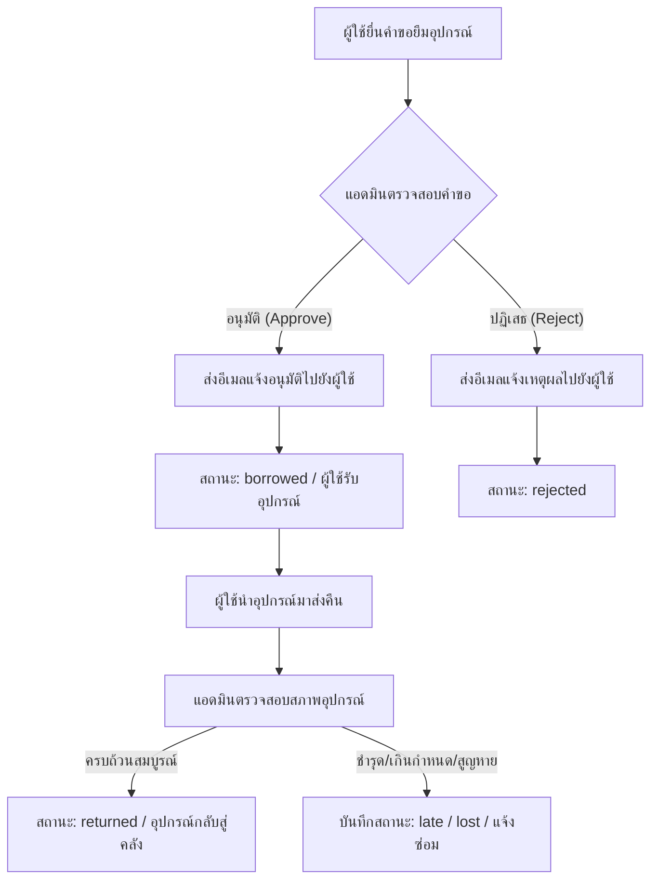
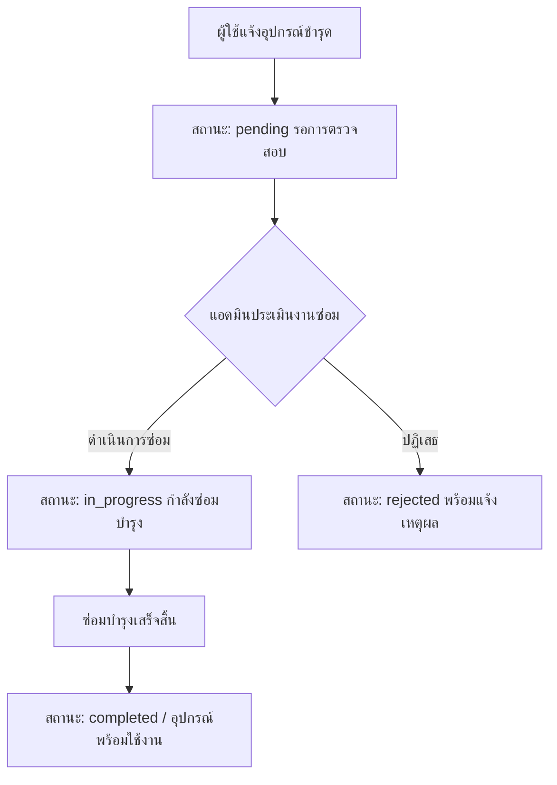

# 📦 AssetFlow - ระบบยืม-คืนอุปกรณ์ (Equipment Borrow & Return System)

[](https://nodejs.org/)
[](https://expressjs.com/)
[](https://www.mongodb.com/)
[](https://getbootstrap.com/)
[](https://ejs.co/)

> **AssetFlow** เป็นเว็บแอปพลิเคชันสำหรับบริหารจัดการการยืม-คืนอุปกรณ์ ครุภัณฑ์ และระบบแจ้งซ่อมบำรุงแบบครบวงจร พัฒนาขึ้นเพื่อช่วยให้องค์กรหรือสถานศึกษาควบคุม ตรวจสอบสถานะ และติดตามอุปกรณ์ได้อย่างมีประสิทธิภาพ พร้อมระบบแจ้งเตือนผ่านอีเมลแบบอัตโนมัติ

---

## 📑 สารบัญ (Table of Contents)

1. [ฟังก์ชันเด่นของระบบ (Features)](#-ฟังก์ชันเด่นของระบบ-features)
2. [ผังการทำงานของระบบ (System Workflow)](#-ผังการทำงานของระบบ-system-workflow)
3. [เทคโนโลยีที่ใช้พัฒนา (Tech Stack)](#-เทคโนโลยีที่ใช้พัฒนา-tech-stack)
4. [โครงสร้างฐานข้อมูล (Database Schema)](#-โครงสร้างฐานข้อมูล-database-schema)
5. [โครงสร้างโฟลเดอร์โปรเจกต์ (Project Structure)](#-โครงสร้างโฟลเดอร์โปรเจกต์-project-structure)
6. [ขั้นตอนการติดตั้งและเริ่มใช้งาน (Getting Started)](#-ขั้นตอนการติดตั้งและเริ่มใช้งาน-getting-started)
7. [การตั้งค่า Environment Variables](#-การตั้งค่า-environment-variables)
8. [บัญชีผู้ใช้งานเริ่มต้นและการทดสอบ](#-บัญชีผู้ใช้งานเริ่มต้นและการทดสอบ)
9. [ผู้จัดทำและข้อมูลวิชา](#-ข้อมูลรายวิชาและผู้จัดทำ)

---

## 🌟 ฟังก์ชันเด่นของระบบ (Features)

### 👤 1. ส่วนของผู้ใช้งานทั่วไป (User)
* **Authentication & Session:** สมัครสมาชิก, เข้าสู่ระบบ, จดจำ Session ผู้ใช้ และเปลี่ยนรหัสผ่านได้อย่างปลอดภัย (เข้ารหัสด้วย `bcryptjs`)
* **Equipment Browsing & Search:** ดูรายการอุปกรณ์ทั้งหมดในระบบ ค้นหาตามชื่อ และกรองตามหมวดหมู่ พร้อมแสดงสถานะความพร้อมใช้งาน (Available / Unavailable / Broken)
* **Borrow Request:** ยื่นคำขอยืมอุปกรณ์ โดยสามารถระบุวันที่ต้องการคืนและเหตุผลหรือหมายเหตุประกอบการยืมได้
* **Borrow History & Tracking:** ติดตามสถานะคำขอยืมของตนเองแบบเรียลไทม์:
  * `waiting` (รอการอนุมัติ)
  * `borrowed` (กำลังยืม / อนุมัติแล้ว)
  * `waitingForReturn` (ส่งคืนแล้ว / รอแอดมินยืนยัน)
  * `returned` (คืนสำเร็จเรียบร้อย)
  * `rejected` (คำขอถูกปฏิเสธ)
  * `late` (เกินกำหนดคืน)
  * `lost` (สูญหาย)
* **Repair Request (แจ้งซ่อม):** แจ้งอุปกรณ์ชำรุดเสียหาย พร้อมระบุรายละเอียดปัญหา และติดตามความคืบหน้าการซ่อมได้
* **Profile Management:** แก้ไขข้อมูลส่วนบุคคล และอัปโหลดรูปโปรไฟล์ (รองรับไฟล์รูปภาพผ่าน Multer)

---

### 🛡️ 2. ส่วนของผู้ดูแลระบบ (Admin)
* **Dashboard:** หน้าสรุปภาพรวมและสถิติต่างๆ เช่น จำนวนผู้ใช้งานทั้งหมด จำนวนอุปกรณ์ และจำนวนรายการยืม-คืนในระบบ
* **Borrow Approval System:** ตรวจสอบคำขอยืม อนุมัติ (Approve) หรือปฏิเสธ (Reject) พร้อมบันทึกเหตุผล
* **Automated Email Notification:** ส่งอีเมลแจ้งผลการอนุมัติ/ปฏิเสธคำขอยืมไปยังอีเมลของผู้ใช้โดยตรงอัตโนมัติผ่าน EmailJS API
* **Return Management:** บันทึกการรับคืนอุปกรณ์ ตรวจสอบสภาพ และปรับสถานะอุปกรณ์คืนสู่คลัง
* **Equipment Management (CRUD):** 
  * เพิ่มรายการอุปกรณ์ใหม่ พร้อมอัปโหลดรูปภาพ
  * แก้ไขข้อมูลและสถานะของอุปกรณ์
  * ระบบ **Soft Delete** (ลบแบบปลอดภัย มีประวัติถังขยะ สามารถกู้คืนหรือลบถาวรได้)
* **Category Management:** เพิ่ม/ลบ/แก้ไข หมวดหมู่อุปกรณ์
* **Repair Request Management:** จัดการคำขอแจ้งซ่อม ปรับสถานะ (`pending`, `in_progress`, `completed`, `rejected`) พร้อมระบุความเห็นของแอดมิน (Admin Comment)
* **User Management:** เพิ่ม ลบ แก้ไขข้อมูลผู้ใช้ และกำหนดสิทธิ์การเข้าถึง (`admin` / `user`) รวมถึงแผนก/สังกัด

---

## 🔄 ผังการทำงานของระบบ (System Workflow)

### 1. กระบวนการยืม - คืนอุปกรณ์ (Borrow & Return Lifecycle)



### 2. กระบวนการแจ้งซ่อมอุปกรณ์ (Repair Request Lifecycle)



---

## 🛠️ เทคโนโลยีที่ใช้พัฒนา (Tech Stack)

| ส่วนประกอบ | รายละเอียดเทคโนโลยี |
| :--- | :--- |
| **Runtime & Framework** | [Node.js](https://nodejs.org/) (v18+) & [Express.js](https://expressjs.com/) (v4.x) |
| **Database & ODM** | [MongoDB](https://www.mongodb.com/) (Atlas Cloud Database) & [Mongoose](https://mongoosejs.com/) (v8.x) |
| **View Engine & UI** | [EJS](https://ejs.co/) (Embedded JavaScript), [express-ejs-layouts](https://www.npmjs.com/package/express-ejs-layouts), [Bootstrap 5](https://getbootstrap.com/), [SweetAlert2](https://sweetalert2.github.io/), Google Font (Kanit) |
| **Authentication & Security** | [Express-Session](https://www.npmjs.com/package/express-session), [Bcryptjs](https://www.npmjs.com/package/bcryptjs), [Cookie-Parser](https://www.npmjs.com/package/cookie-parser) |
| **File Uploads** | [Multer](https://www.npmjs.com/package/multer) (จัดการการอัปโหลดไฟล์รูปภาพอุปกรณ์และรูปโปรไฟล์) |
| **Notification Services** | [EmailJS](https://www.emailjs.com/) / [Resend](https://resend.com/) API สำหรับส่งอีเมลแจ้งเตือน |
| **HTTP Client & Logger** | [Axios](https://axios-http.com/), [Morgan](https://www.npmjs.com/package/morgan) |

---

## 🗄️ โครงสร้างฐานข้อมูล (Database Schema)

ระบบใช้งานร่วมกับ MongoDB โดยมีคอลเลกชันหลักดังนี้:

1. **`users`**: จัดเก็บข้อมูลผู้ใช้งาน
   * `fname`, `lname`, `email`, `password` (hashed), `userProfile`, `userRole` (`admin` / `user`), `department`
2. **`equipments`**: จัดเก็บรายการอุปกรณ์
   * `name`, `category_id`, `description`, `status` (`available` / `unavailable` / `broken`), `image`, `location`, `deleted_at`
3. **`categories`**: จัดเก็บหมวดหมู่ของอุปกรณ์
   * `name`, `deleted_at`
4. **`departments`**: จัดเก็บแผนกหรือฝ่ายสังกัด
   * `name`, `deleted_at`
5. **`borrows`**: จัดเก็บประวัติและรายการยืม-คืน
   * `user_id`, `equipment_id`, `return_date`, `actual_return_date`, `note`, `status` (`waiting`, `borrowed`, `waitingForReturn`, `returned`, `rejected`, `late`, `lost`)
6. **`repair_requests`**: จัดเก็บข้อมูลคำขอแจ้งซ่อม
   * `user_id`, `equipment_id`, `issue_description`, `admin_comment`, `completion_date`, `status` (`pending`, `in_progress`, `completed`, `rejected`)

---

## 📁 โครงสร้างโฟลเดอร์โปรเจกต์ (Project Structure)

```text
project_CP363205_EquipmentBorrow-ReturnSystem/
├── README.md                          # เอกสารคู่มือโปรเจกต์
└── labExpressNodeJS/                  # ซอร์สโค้ดหลักของระบบ
    ├── app.js                         # จุดเริ่มต้นของ Express Application และการตั้งค่า Middleware
    ├── package.json                   # การประกาศ Dependencies และสคริปต์สั่งรัน
    ├── .env.example                   # ไฟล์ตัวอย่างสำหรับการตั้งค่า Environment Variables
    ├── bin/
    │   └── www                        # ไฟล์สำหรับเริ่ม HTTP Server
    ├── middleware/
    │   └── auth.js                    # Middleware ตรวจสอบสิทธิ์ (isAuthenticated, isAdmin, isUser)
    ├── models/                        # Mongoose Schemas & Data Models
    │   ├── Borrow.js                  # Model รายการยืม-คืน
    │   ├── Category.js                # Model หมวดหมู่อุปกรณ์
    │   ├── Department.js              # Model แผนก
    │   ├── listEquipment.js           # Model อุปกรณ์
    │   ├── Reqair_requests.js         # Model คำขอแจ้งซ่อม
    │   └── User.js                    # Model ผู้ใช้งาน
    ├── public/                        # Static Assets (Images, Icons, Custom Styles, Client Scripts)
    ├── routes/                        # API & Page Routing
    │   ├── admin.js                   # Route สำหรับการจัดการของผู้ดูแลระบบ (Admin)
    │   ├── index.js                   # Route หน้าแรก, เข้าสู่ระบบ, สมัครสมาชิก
    │   └── users.js                   # Route สำหรับผู้ใช้งานทั่วไป (User)
    ├── uploads/                       # โฟลเดอร์เก็บไฟล์ภาพที่อัปโหลด (Avatar, Equipment images)
    └── views/                         # EJS Templates สำหรับแสดงผลหน้าเว็บ
        ├── layouts/                   # Master Layouts (index, auth, navadmin, navuser)
        ├── login.ejs                  # หน้าเข้าสู่ระบบ
        ├── register.ejs               # หน้าสมัครสมาชิก
        ├── equipmentAdmin.ejs         # หน้าจัดการอุปกรณ์ (Admin)
        ├── Borrowequipment.ejs        # หน้าอนุมัติการยืม (Admin)
        ├── returnEquipmentAdmin.ejs   # หน้าบันทึกรับคืน (Admin)
        ├── reqair_requestsAdmin.ejs   # หน้าจัดการแจ้งซ่อม (Admin)
        ├── manage_user.ejs            # หน้าจัดการสมาชิก (Admin)
        ├── indexUser.ejs              # หน้าหลักของผู้ใช้
        └── userBorrowHistory.ejs      # หน้าประวัติการยืม-คืนของผู้ใช้
```

---

## 🚀 ขั้นตอนการติดตั้งและเริ่มใช้งาน (Getting Started)

### 1. ความต้องการของระบบ (Prerequisites)
* [Node.js](https://nodejs.org/) เวอร์ชั่น 18.0.0 ขึ้นไป
* [npm](https://www.npmjs.com/) หรือ [yarn](https://yarnpkg.com/)
* บัญชีหรือ Connection URI ของ [MongoDB Atlas](https://www.mongodb.com/cloud/atlas) (หรือ Local MongoDB)

### 2. ดาวน์โหลดโปรเจกต์ (Clone Repository)
```bash
git clone https://github.com/chaiyawat19/project_CP363205_EquipmentBorrow-ReturnSystem.git
cd project_CP363205_EquipmentBorrow-ReturnSystem/labExpressNodeJS
```

### 3. ติดตั้ง Dependencies
```bash
npm install
```

### 4. ตั้งค่า Environment Variables
คัดลอกไฟล์ `.env.example` ไปเป็น `.env` และกรอกข้อมูลการเชื่อมต่อจริง:
```bash
cp .env.example .env
```
*(สำหรับ Windows PowerShell: `copy .env.example .env`)*

### 5. เริ่มต้นรันเซิร์ฟเวอร์ (Run Server)
```bash
npm start
```
หรือรันผ่าน Node โดยตรง:
```bash
node app.js
```

### 6. เข้าใช้งานผ่าน Web Browser
เปิดเบราว์เซอร์แล้วไปที่:
```text
http://localhost:3001
```

---

## ⚙️ การตั้งค่า Environment Variables

สร้างไฟล์ `.env` ไว้ที่โฟลเดอร์ `labExpressNodeJS/` โดยกำหนดค่าตัวแปรดังต่อไปนี้:

```env
# MongoDB Connection URI
MONGODB_URI=mongodb+srv://<username>:<password>@cluster0.xxxxx.mongodb.net/<dbname>

# Port สำหรับ Server (Default: 3001)
PORT=3001

# Resend API Key (ถ้าต้องการใช้งานส่งอีเมลผ่าน Resend)
RESEND_API_KEY=re_xxxxxxxxxxxxxxxxxxxx

# EmailJS Service Credentials (สำหรับการส่งอีเมลแจ้งเตือนผลการอนุมัติ)
EMAILJS_SERVICE_ID=service_xxxxxxx
EMAILJS_PUBLIC_KEY=xxxxxxxxx
EMAILJS_PRIVATE_KEY=xxxxxxxxx
EMAILJS_TEMPLATE_ID_APPROVE=template_xxxxxxx
EMAILJS_TEMPLATE_ID_REJECT=template_xxxxxxx
```

---

## 🔑 บัญชีผู้ใช้งานเริ่มต้นและการทดสอบ

ระบบมีการแบ่งสิทธิ์ชัดเจนผ่าน Middleware:
* **Admin (ผู้ดูแลระบบ):** เข้าถึง URL `/admin/*` จัดการระบบทั้งหมด
* **User (ผู้ใช้งานทั่วไป):** เข้าถึง URL `/users/*` เพื่อค้นหาอุปกรณ์ ยื่นขอยืม และแจ้งซ่อม

> 💡 **คำแนะนำ:** เมื่อเริ่มต้นใช้งานครั้งแรก สามารถลงทะเบียนผ่านหน้า `/register` แล้วเข้าไปปรับเปลี่ยนค่า `userRole` เป็น `'admin'` โดยตรงผ่านฐานข้อมูล MongoDB Atlas หรือผ่านแอดมินที่มีอยู่แล้วในระบบ

---

## 🎓 ข้อมูลรายวิชาและผู้จัดทำ

* **รหัสวิชา:** CP363205 / SC363205
* **ชื่อโปรเจกต์:** AssetFlow - Equipment Borrow & Return System
* **GitHub Repository:** [chaiyawat19/project_CP363205_EquipmentBorrow-ReturnSystem](https://github.com/chaiyawat19/project_CP363205_EquipmentBorrow-ReturnSystem)
